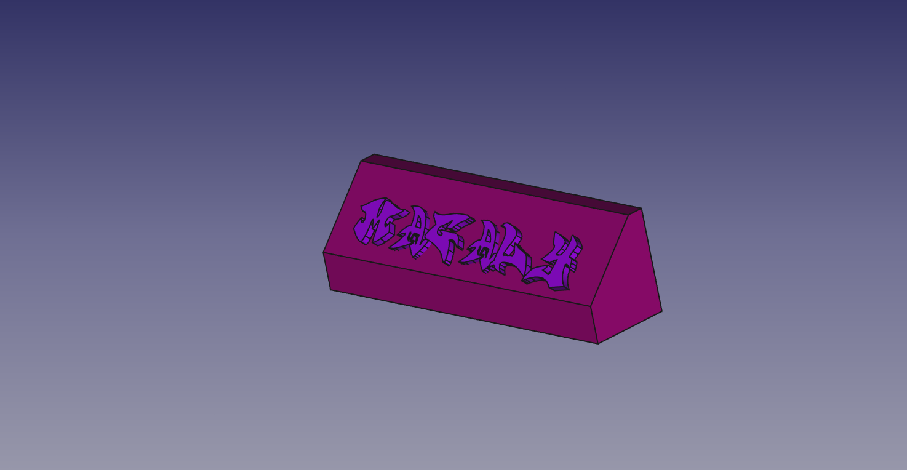

# Freecad key chain library
A library of 3D printable open source key chains designed in Freecad

 | 
:-------------: | :-------------:
This is my 3D Design of FreeCAD. | 3d printed version 

# License 

The 3D key chain designs are licensed under a [Creative Commons Attribution-ShareAlike 4.0 International License](http://creativecommons.org/licenses/by-sa/4.0/)

# Contribute

  Please, do not heasitate on contributing to this library
